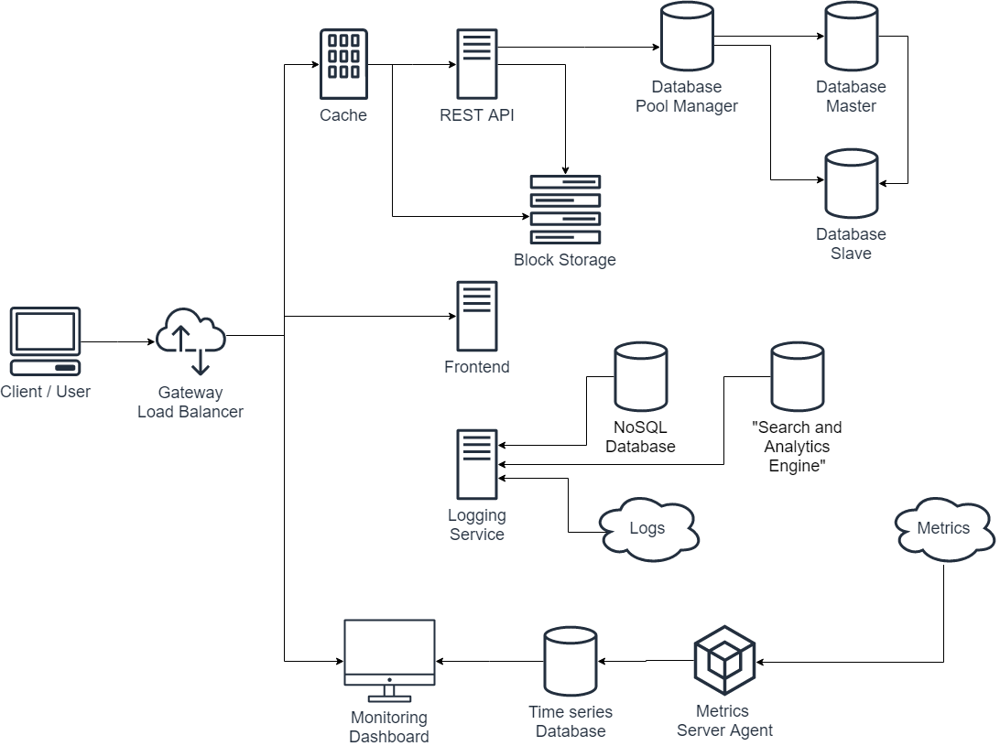

# REST API for image gallery service

## Technology used

This API is coded in Django REST framework, using many core features of core Django framework and leveraging the features added in DRF. 

The created service integrates with other core application components, such as a database, block storage and other external APIs for logging and monitoring.

The diagram shows the general components without naming any specific softwares being used.


## Documentation

Basic API documentation can be found [here](api_documentation.md).

More thorough documentation of the API's endpoints, methods and parameters can be found at path [] [here](http://195.148.20.53:8000/swagger).

---

## Features

- **Ability to upload a new image**
- **Ability to list uploaded images**
- **Pagination / limitation of results**
- **List uploads per user (@username or @me)**
- **Ability to remove an uploaded image**
- **Ability to vote (upvote, downvote) an image**
- **Ability to mark image as a favorite or remove it**
- **Ability to comment on a image**
- **Ability to edit or remove comments**

- **Ability to create a user / register**
- **Ability to login and logout**
- **Able to list most "trending" images (most upvoted for the last 24 hours)**
- **Logging is done to an external logging server**

- **API contains tests**
- **Ability to download favorites as a zip / export**
- **Login using a Google / Facebook / etc. account**
- **Multiple user levels (admin, normal user, anonymous)**
- **Public (shows up in recent uploads) and private (only visible to self) gallery**
- **Report this image feature**

---

## How to run

* Build docker image and run in backround, REST API  runs on port 8000.

```
 docker compose up --build -d
```
* Run tests

```
 docker-compose run rest python manage.py test
```
## Envinronment
There are two filed with envinronment variables. Variables names are self-explanatory.
* .env - for Minio service
```
MINIO_ACCESS_KEY
MINIO_SECRET_KEY
MINIO_STORAGE_ENDPOINT
``` 
* ./rest/.env.dev
```
DEBUG
SECRET_KEY
DJANGO_ALLOWED_HOSTS
SQL_ENGINE
SQL_DATABASE
SQL_USER
SQL_PASSWORD
SQL_HOST
SQL_PORT
FACEBOOK_KEY
FACEBOOK_SECRET
GOOGLE_KEY
GOOGLE_SECRET
```
